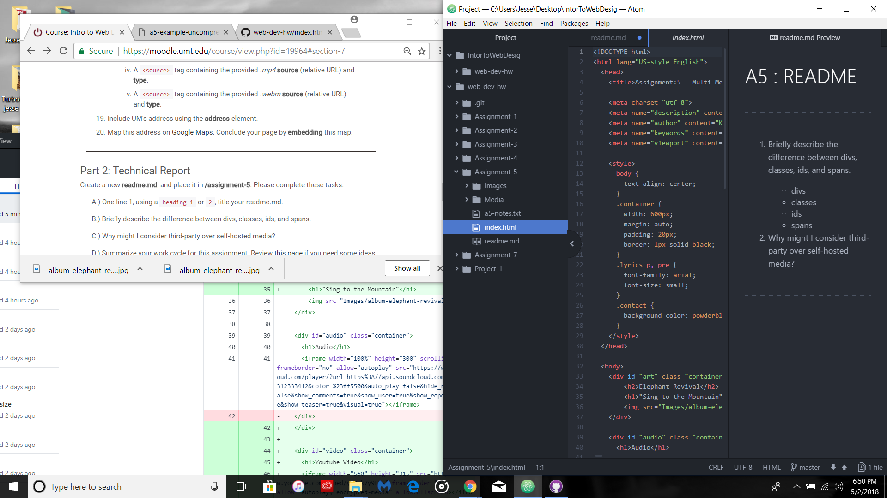

# A5 : README
***
1. Briefly describe the difference between divs, classes, ids, and spans.

  * **divs:** The dive element is used to encapsulate other page elements and divide the document into sections, it is also used to apply CSS style to many elements all at once.
  * **classes:** The class attribute is used to specify and identify different HTML elements.
  * **ids:** The ID attribute is used to specifies unique ID's for an HTML element. This is mostly used to point out sstyles in a style sheet.
  * **spans:** The span tag, much like the div tag has no meaning to it. This tag is used for styling by using the id or class attribute.

2. Why might I consider third-party over self-hosted media?

  * You might want to consider using third-party hosting because it uses less bandwidth, making it cheaper. Also third-part hosting allows you to display high quality media and make compatibility better.

***
By this assignment I feel way more comfortable with html, setting up my pages and just my work flow. I didn't really run into too many struggles with this assignment.

